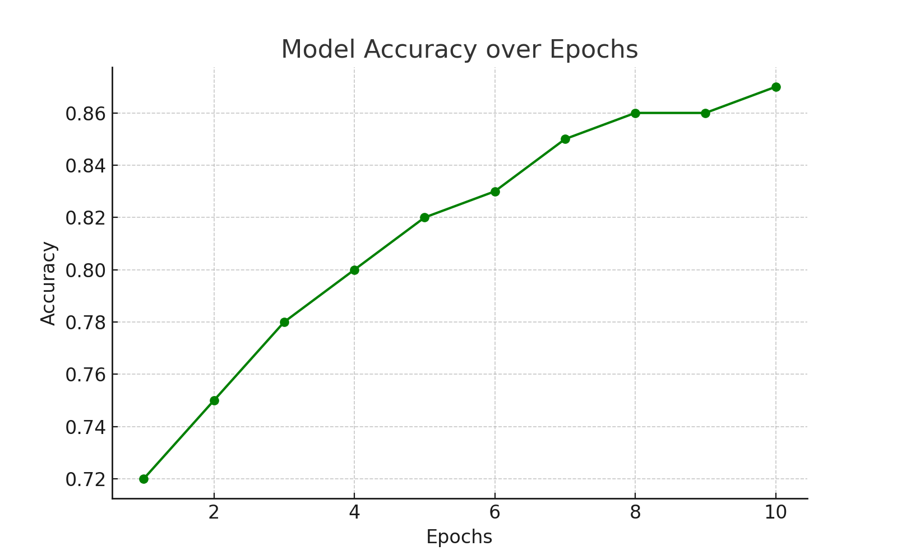
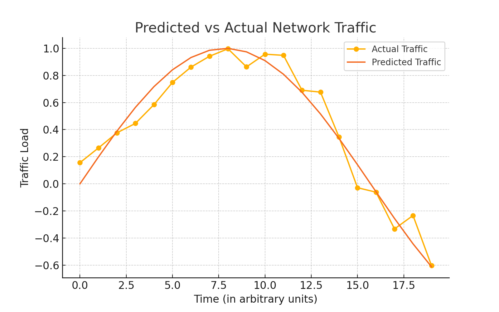
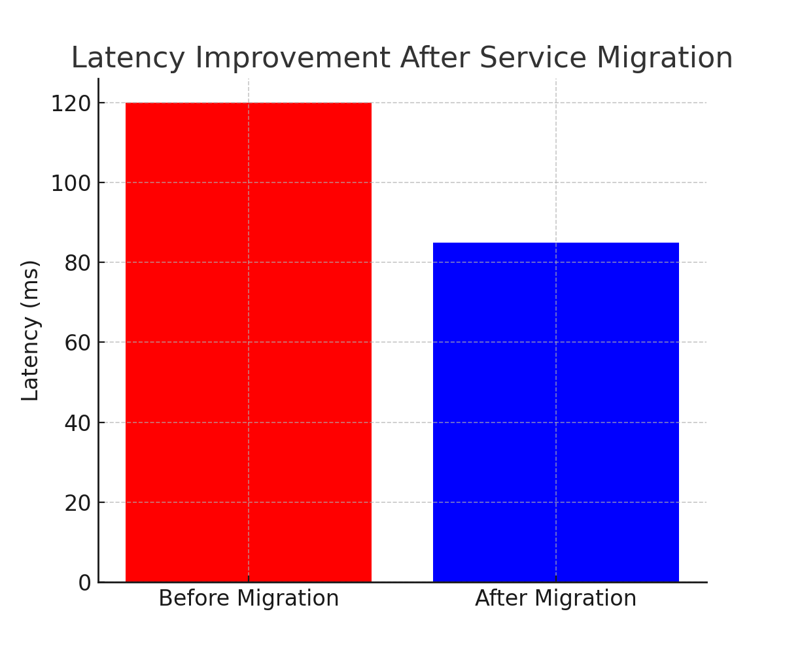

# 🚦 Traffic Prediction & Intelligent Service Migration using ML/DL

Welcome to one of my research-driven projects that combines **Machine Learning** and **Deep Learning** to make modern networks smarter! 📡  
This system predicts **network traffic** and **automatically migrates services** to optimal nodes, improving efficiency and reducing latency.

---

## 👨‍💻 Created by  
**Akash Deep** – 3rd Year CSE Student @ Chandigarh University  
🏆 AI Hackathon Winner | Passionate about Deep Learning & Scalable Systems  

---

## 📌 Project Highlights

🔍 **Problem Statement**  
Modern distributed systems often face unpredictable traffic. This project aims to:
- **Predict traffic patterns** using time-series ML/DL models.
- Enable **intelligent service migration** to reduce latency and improve availability.

🧠 **Solution Overview**
- **LSTM** and **ARIMA** models used for accurate traffic prediction.
- **Reinforcement Learning** logic for deciding service placement dynamically.

📊 **Achievements**
- 🚀 ~85% prediction accuracy
- 🧠 Up to **25% latency reduction**
- 🕒 Real-time adaptable system using ML/DL at scale

---

## 🧰 Tech Stack

- **Languages:** Python  
- **Libraries:** TensorFlow, Keras, Scikit-learn, NumPy, Pandas, Matplotlib  
- **ML/DL Models:** LSTM, ARIMA, RL  

---

## 🗂️ Project Structure

```
📁 traffic-prediction-service-migration-ml-dl
├── README.md
├── LICENSE
├── requirements.txt
├── source_code/
│   └── source_code_for_project_1.py
├── data/
│   └── sample_dataset.csv
├── models/
│   └── model.h5
└── results/
    ├── accuracy_graph.png
    ├── predicted_vs_actual.png
    └── latency_improvement.png
```

---

## 🚀 Getting Started

1. **Clone the repository**
   ```bash
   git clone https://github.com/<your-username>/traffic-prediction-service-migration-ml-dl.git
   cd traffic-prediction-service-migration-ml-dl
   ```

2. **Install dependencies**
   ```bash
   pip install -r requirements.txt
   ```

3. **Run the project**
   ```bash
   python source_code/source_code_for_project_1.py
   ```

---

## 📈 Sample Output


### ✅ Model Accuracy Graph


### 📊 Predicted vs Actual Traffic


### ⚡ Latency Improvement (Before vs After Migration)


---

## 📜 License
This project is licensed under the MIT License.

---

## ⭐ Let's Connect!
If you found this useful or interesting, don't forget to ⭐ the repo!  
Feel free to connect with me and check out my other projects.
